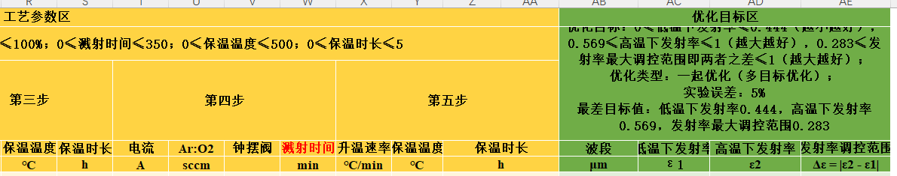
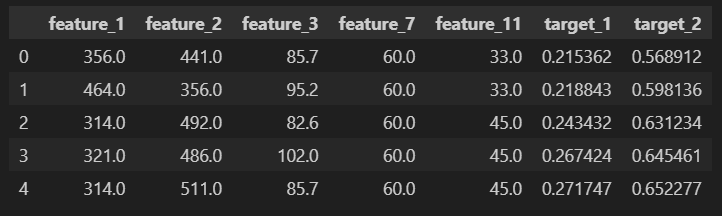
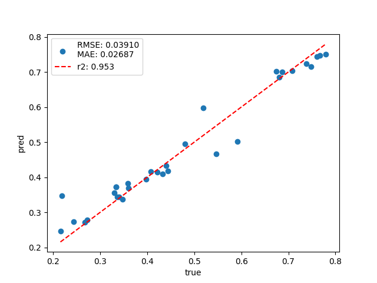
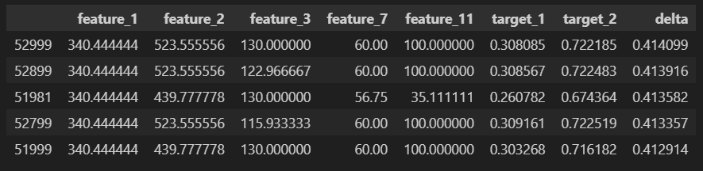
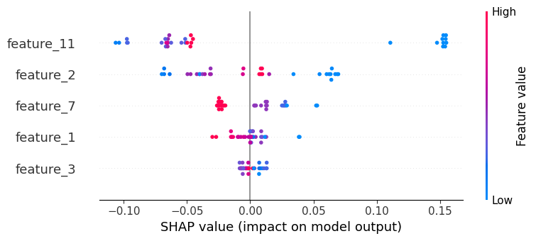

# 自动机器学习预测材料性能、实验参数优化流程

## 数据清洗

- 原始表格：变发射率
- 
- 原始表格包含内容一致的列，需清除；
- 数字类型特征转换为浮点数，类别特征保持原类型；
- 经过清洗后的数据示例：
- 
  
## 机器学习

- 使用Autogluon库实现自动机器学习，能自动实现特征工程、超参数调优；
- 包含多种机器学习模型，能自动实现模型融合，提升拟合效果；
- 每项性能单独预测，数据量较少时不划分验证集，因此仅供参考；
- 预测效果示例：
- 
  
## 性能预测

- 根据原始数据范围进行格点搜索，生成筛选列表；
- 用自动机器学习模型预测这些参数对应的材料性能；
- 根据多目标优化条件排序，筛选合适的实验参数；
- 例：变发射率材料希望 (高温发射率 - 低温发射率) 大，特征有5列，则生成10^5组参数，最后按差值由大到小排序 (delta = target_2 - target_1)
- 

## 与贝叶斯优化的异同

- 贝叶斯优化的代理模型除了返回预测值，还会返回不确定度；
- 采样函数根据预测值和不确定度决定下一步实验参数；
- 采样具有随机性，因此贝叶斯优化每次返回结果可以不同；
- 与本流程的核心区别在于考虑了不确定度；
- 高斯过程拟合小数据集效果可能较好，但对于大数据集拟合能力有限且占用内存高；
- 自动机器学习拟合能力强，但对于小数据集可能过拟合。

## 可解释性

- 使用SHAP方法分析特征的重要性、对目标的影响；
- 例：
- 
- 排在上面的特征对目标影响大（从上到下分别为"第二步/溅射时间"、"WO3介质层厚度"、"第一步/溅射时间"、"Al金属层厚度"、"VO2层厚度"，目标为"低温下发射率"）；
- 图像上每一个点代表样本。每一行点表征该特征对样本点的影响，读图方法：

    ### 图表结构解析

    | 维度 | 含义 | 图中表现 |
    |------|------|----------|
    | **横轴** | SHAP值（特征影响力） | 越靠**右**（正值），表示该特征将模型输出**推高**；越靠**左**（负值），表示将输出**降低** |
    | **纵轴** | 特征按重要性排序 | 从上到下降序排列，`feature_11` 最重要，`feature_3` 最不重要 |
    | **颜色** | 特征值高低 | **红色** = 特征值高（High），**蓝色** = 特征值低（Low） |
    | **每个点** | 单个样本 | 每个点代表一个数据样本在该特征上的SHAP值 |

    ### 三步阅读法

    1. **看纵轴找重点**：关注排在最上面的特征，它们对模型决策影响最大
    2. **看横轴知方向**：点在右边（正）→ 推高预测；在左边（负）→ 降低预测
    3. **看颜色辨关系**：
       - 蓝左红右 → 正相关（值越大，预测越高）
       - 红左蓝右 → 负相关（值越大，预测越低）
       - 颜色混杂 → 非线性关系或存在交互效应

- 本例中feature_7（"Al金属层厚度"）是比较严格的红左蓝右，表明增加"Al金属层厚度"有利于降低"低温下发射率"，但影响幅度不如feature_11（"第二步/溅射时间"）和feature_12（"WO3介质层厚度"），它们的展宽更大，但是颜色混杂，对目标的影响不好判断。